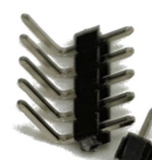

# 超级立方豆硬件制作
项目完整入口请见 [Crazycube-Portal](https://github.com/crazy-luke/crazycube-portal)

## 目录说明
目录  				|说明
----------------	| -------------
Gerber/			|PCB 生产文件, 包括主板和屏幕板
BOM/				|清单：mainboard.html 主板元件BOM， extendboard.html 屏幕板
STL/				|外壳 3D 打印文件
Schematic/		|原理图 schematic.pdf

## 制作说明
1.  超级立方豆原版外壳采用 采用 FDM  3D 打印机，你也可以使用光固化。
	后盖Back_F.stl需要支撑， 前盖Font_F.stl不需要支撑。

2.  手势识别和按钮都可以操作AppOS，如果考虑成本因素可以不使用手势识别。

3. 固件烧录和版本移步主入口[Crazycube-Portal](https://github.com/crazy-luke/crazycube-portal)
 

4. 支持  
超级立方豆集成度较高，新手排错可能有一定难度，有问题可以给B站 [疯狂豆Luke](https://www.bilibili.com/video/BV1Xs4y1A7rm) 留言。  

## 以下是一些网友问题整理

### 手势识别模块 

* GY-PAJ7620U2。2.54mm 90度单排弯针插接。  
* 模块与主板连接方式，可以直接焊接，也可以插接母座（母座参考高度5～6mm）

### 按键
* 原版使用 8.3CM 轻触开关 （TS-B010 , 8.3H）
* 左右按钮键帽：PVC硅胶，6.4x3.4 （非必需）

### 屏幕版
* 连接器是 FFC_0.5_24,  24P 抽屉式 上接 
* 屏幕 1.3寸 240*240 24pin 插接式。  （注意是插接式）

## 声明
本项目仅供个人学习使用，未经允许不得用于任何商业用途。

## License

 This work is licensed under a <a rel="license" href="http://creativecommons.org/licenses/by-nc-nd/4.0/">Creative Commons Attribution-NonCommercial-NoDerivatives 4.0 International License</a>.

Copyright © 2023, 疯狂豆® 
 